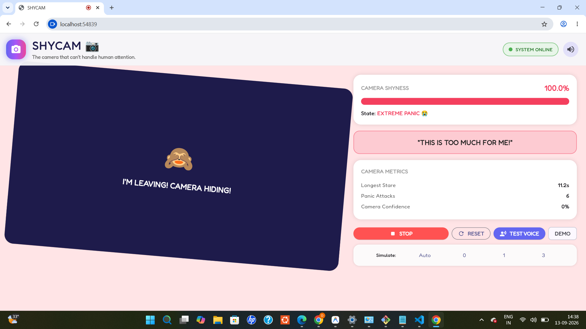
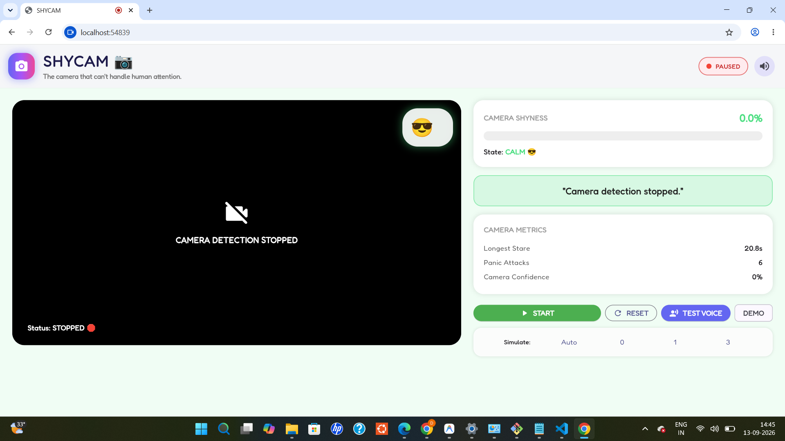
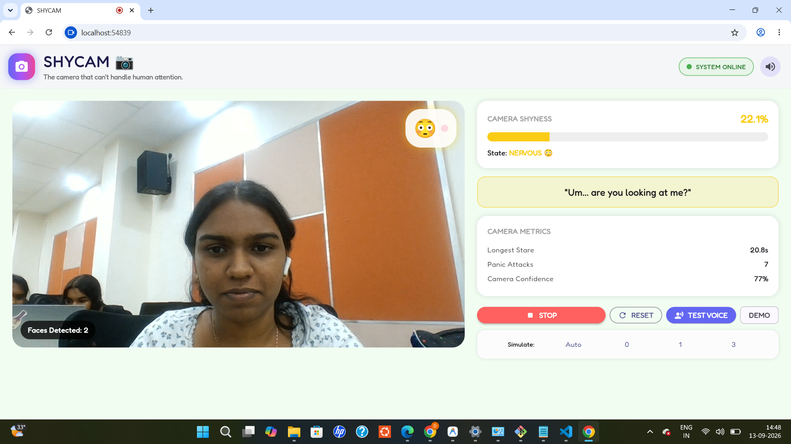
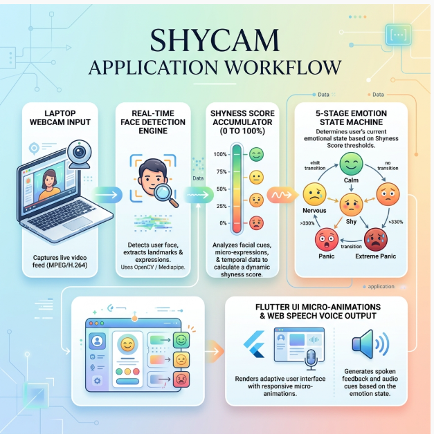

# [SHYCAM] 🎯

## Basic Details
### Team Name: [BADSIGNAL]

### Team Members
- Member 1: [Aksa Jaison] - [MACE]
- Member 2: [Devika B S] - [MACE]

### Project Description
[SHYCAM is an intentionally useless, humorous web application where your laptop's built-in webcam develops severe social anxiety whenever humans look into it. Instead of remaining a passive camera, it blushes, trembles, panics, speaks out loud in a cute robotic voice, and eventually hides behind a curtain when people stare for too long or crowd around it.]

### The Problem (that doesn't exist)
[Standard webcameras suffer from a severe lack of emotional vulnerability. They stare back at users with unyielding, cold confidence, completely ignoring how awkward constant eye contact can be. No camera has ever stopped to ask: "What if I'm just not camera-ready today?"]

### The Solution (that nobody asked for)
[We created SHYCAM — the world's first camera hardware with crippling stage fright! Powered by real-time webcam face detection and a dynamic 5-stage emotion engine (CALM → NERVOUS → SHY → PANIC → EXTREME PANIC), the camera blushes, sweats, trembles, speaks flustered quotes out loud via Web Speech synthesis, and physically drops a curtain to hide when too many people look at it!]

## Technical Details
### Technologies/Components Used
For Software:
- [Dart, JavaScript (ES6+), HTML5, CSS3]
- [Flutter Web (v3.47+)]
- [camera_web, flutter_animate, google_fonts, web, Web Speech Synthesis API, Chromium Shape Detection API (window.FaceDetector)]
- [Visual Studio Code, Git, GitHub, Google Chrome Browser]

### Implementation
For Software:
# Installation
[git clone https://github.com/Devikabs-prog/shycam.git
cd shycam
flutter pub get]

# Run
[flutter run -d chrome]

### Project Documentation
For Software:

# Screenshots (Add at least 3)

*camera is shut while detecting the face*

*camera detection stopped*

*detecting face*

# Diagrams

*SHYCAM Workflow: How webcam video turns into real-time camera shyness and voice reactions*

---
Made with ❤️ at TinkerHub Useless Projects 

